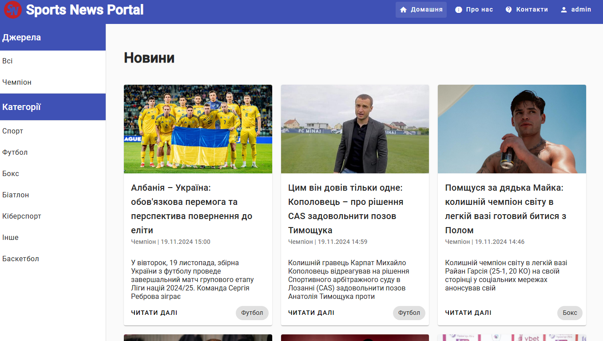

# Sports News Project

## Установка та залежності

- Клонувати репозиторій:
```sh
git clone https://github.com/gemenej/sports-news-project.git
```

- Встановити залежності для бекенду:
```sh
cd sports-news-project/sports-news-service
npm install
```

- Встановити залежності для фронтенду:
```sh
cd sports-news-project/sports-news-app
npm install
```

- Встановити mongodb, якщо він не встановлений:
-- [Windows](https://docs.mongodb.com/manual/tutorial/install-mongodb-on-windows/)
-- [Linux](https://docs.mongodb.com/manual/administration/install-on-linux/)
-- [Mac](https://docs.mongodb.com/manual/tutorial/install-mongodb-on-os-x/)

- Для зручності і візуального представлення даних можна встановити [Compass](https://www.mongodb.com/products/compass)
-- [Windows](https://docs.mongodb.com/compass/master/install/)
-- [Linux](https://docs.mongodb.com/compass/master/install/)
-- [Mac](https://docs.mongodb.com/compass/master/install/)

- Запустити mongodb:
-- [Windows](https://docs.mongodb.com/manual/tutorial/install-mongodb-on-windows/#start-mdb-edition)
-- [Linux](https://docs.mongodb.com/manual/administration/install-on-linux/)
-- [Mac](https://docs.mongodb.com/manual/tutorial/install-mongodb-on-os-x/)

- Після цього відкрити Compass і підключитися до бази даних:
-- Hostname: localhost
-- Port: 27017

- При запуску бекенд частини база даних буде автоматично буде створена.

- Налаштування змінних середовища бекенду:
-- Створити файл `.env` у папці `sports-news-service` та вказати наступні змінні середовища:
```sh
PORT=3000
MONGODB_URI=mongodb://localhost:27017/sports-news
JWT_SECRET=somesupersecretsecret
REFRESH_TOKEN=somesupersecretrefresh
PERIOD_MIN=60
```

## Запуск та інтерфейс

- Запуск бекенду:
```sh
cd sports-news-project/sports-news-service
npm run dev
```

- Запуск фронтенду:
```sh
cd sports-news-project/sports-news-app
ng serve
# or
npm start
```

- Відкрити браузер та перейти за посиланням `http://localhost:4200/`

- Відобразиться таке вікно:
    [](./images/home.png)

- Для входу в адмін панель використовувати наступні дані (по замовчуванню):
-- Email: `admin@localhost.com`
-- Пароль: `root`
    [](./images/login.png)

> Можна створити нового користувача на сторінці реєстрації.

- Для створення нової категорії в адмін панелі:
-- Клацнути на кнопку адміна або іншого створеного користувача
    [](./images/admin.png)
-- У випадаючому меню вибрати `Категорії`
    [](./images/admin-menu.png)
-- Відобразиться таке вікно:
    [](./images/categories.png)
-- Тут можна створити нову категорію, видалити або редагувати існуючу.
    [](./images/category.png)


- Для створення нового джерела новин в адмін панелі:
-- Клацнути на кнопку адміна або іншого створеного користувача
    [](./images/admin.png)
-- У випадаючому меню вибрати `Джерела`
    [](./images/admin-menu.png)
-- Відобразиться таке вікно:
    [](./images/sources.png)
-- Тут можна створити нове джерело, видалити або редагувати існуюче.
    [](./images/source.png)

> Є можливість додати селектори для парсингу новин з джерел. Наприклад у полі `wrapper` вказати селектор (`.some-class`, `#some_id`, тощо), який обгортає всі новини на сторінці джерела, а в полі `selector` вказати селектор (`p`, `span`, тощо), який обгортає кожну окрему новину. Це дозволить парсити новини з більшості джерел.

- Для запуску парсера новин:
-- На сторінці `Джерела` клацнути на кнопку `Почати парсинг`
    [](./images/parse.png)

> Парсер запускатиметься кожні 60 хвилин (за замовчуванням). Це можна змінити в файлі `.env` змінною `PERIOD_MIN`.
> Після старту парсера новин, пеенаправить на головну сторінку, для відображення нових новин.
    [](./images/home-full.png)

- Для зупинки парсера новин:
-- На сторінці `Джерела` клацнути на кнопку `Зупинити`
    [](./images/stop.png)


    


